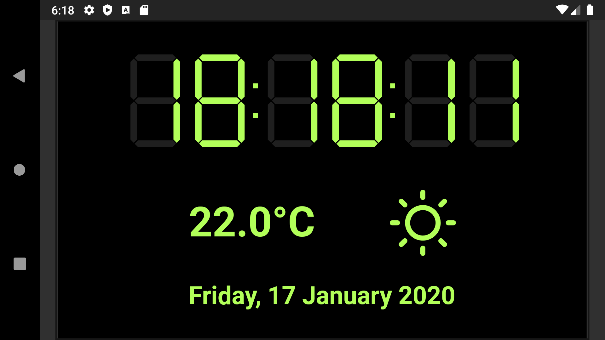

# Digital-Clock

First adventure into Flutter for a Competition to build a clock face.

- [Flutter Clock Challenge](https://flutter.dev/clock)

## Prizes

Grand prize:
A loaded Apple iMac Pro valued at ~\$10,000 USD (detailed specifications may vary based on availability and applicable law in the potential winner’s country of residence)

4 winners:
A Lenovo 10" Smart Display with the Google Assistant valued at ~\$249.00 USD (based on availability and applicable law in the potential winner’s country of residence)

Up to 25 winners:
A Lenovo Smart Clock with the Google Assistant valued at ~\$79.00 USD (based on availability and applicable law in the potential winner’s country of residence)

## Credits

- [Meteocons](http://www.alessioatzeni.com)

## License

    Copyright 2019 Andrew Jackson

    Licensed under the Apache License, Version 2.0 (the "License");
    you may not use this file except in compliance with the License.
    You may obtain a copy of the License at

        http://www.apache.org/licenses/LICENSE-2.0

    Unless required by applicable law or agreed to in writing, software
    distributed under the License is distributed on an "AS IS" BASIS,
    WITHOUT WARRANTIES OR CONDITIONS OF ANY KIND, either express or implied.
    See the License for the specific language governing permissions and
    limitations under the License.
